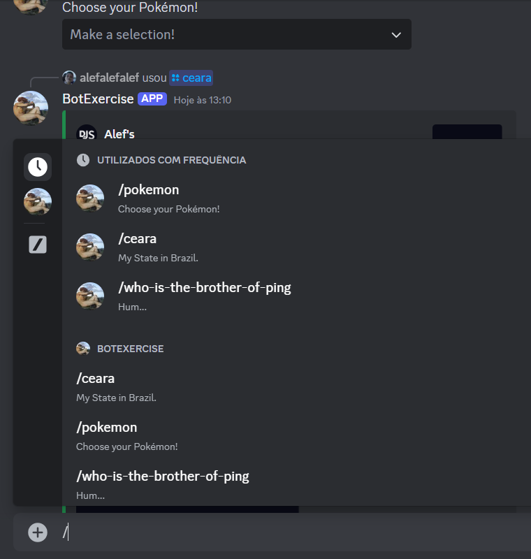

<h2 align="center">Deploy link:</h2>

@[Video on YouTube](https://www.youtube.com/watch?v=IoSifWHSLM4)
</br>
Isn't hosted because I'm not paying any service. Although you can see the video, archives and README.

```
https://www.youtube.com/watch?v=IoSifWHSLM4
```


<h1 align="center" style="color: #805ad5; font-weight: bold;">Product Online Store</h1>
<p align="center">
Topics: 
<a href="#tech">Technolgies</a> |
<a href="#how">How was made</a> |
<a href="#obj">Objective</a>
</p>


<p align="center">
<b>A Discord's bot with commands through the "/".</b>
</p>


<p align="center">
  <p align="center">
    
  </p>
</p>


<h2 id="tech" align="center">Technologies</h2>
JavaScript and Node.js.

### Library:
Discord.js.


<h2 id="how" align="center">How was made</h2>
Isn't hosted because I'm not paying any service. Although you can see the video, archives and README.
</br>
I searched for examples of how to make but I ending doing my own bot.
</br>
Read the Discord.js's document was really important to config the bot's messages.


<h2 id="obj" align="center">Objective</h2>
To demonstrate my knowledge with Node.js and NPM.
